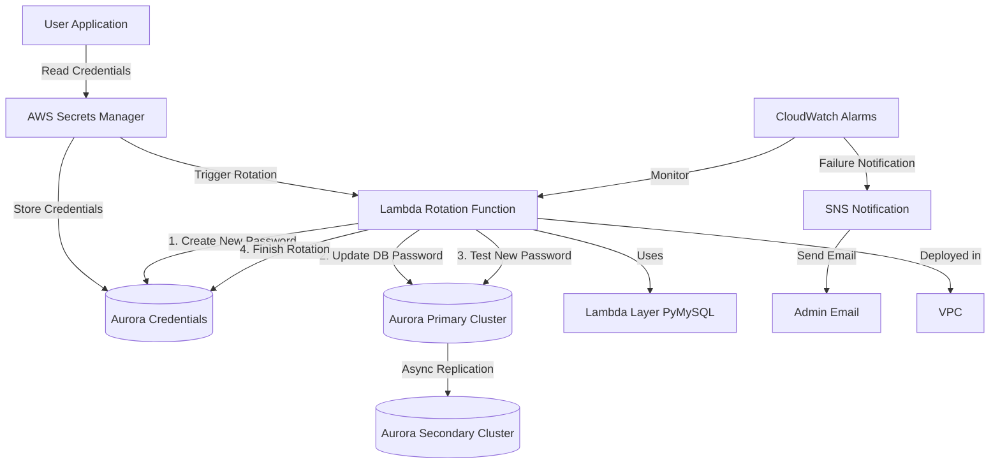

# Aurora Global Database Password Auto-Rotation - CDK Deployment Solution

[中文文档](README.md) | English

This AWS CDK project is designed to automatically deploy a solution for automating the master user password rotation of Aurora Global Databases. Since Aurora Global Databases do not support the native `ManageMasterUserPassword` feature, this solution implements custom password rotation using AWS Secrets Manager and Lambda functions.

## Architecture Overview

The solution includes the following components:

- **AWS Secrets Manager Secret**: Stores the credentials for the Aurora Global Database
- **Lambda Function**: Executes the password rotation logic
- **Lambda Layer**: Contains the PyMySQL library for database connections
- **Rotation Schedule**: Automatically triggers password rotation according to a set schedule (default 90 days)
- **VPC Configuration**: Ensures the Lambda function can access the Aurora database
- **IAM Roles and Policies**: Provides necessary permissions
- **CloudWatch Alarms**: Monitors password rotation failures
- **SNS Notifications**: Sends email notifications when password rotation fails

### Architecture Diagram



## Prerequisites

- AWS account with appropriate permissions
- AWS CLI installed and configured with credentials
- Node.js (≥ 14.x) and npm installed
- Python (≥ 3.9) installed, matching the Lambda runtime version
- Existing Aurora Global Database instance
- VPC and subnet configuration that allows Lambda function to access the database

## Installation Steps

1. **Install AWS CDK**

```bash
npm install -g aws-cdk@2.x
```

2. **Install Project Dependencies**

```bash
pip install -r requirements.txt
```

Project dependencies include:
- aws-cdk-lib >= 2.0.0
- constructs >= 10.0.0
- pymysql >= 1.0.2 (for local development and testing)

3. **Prepare Lambda Layer**

The Lambda layer needs to include the PyMySQL library. The project already includes a `layer/requirements.txt` file. The CDK deployment process will automatically build this layer, but you can also manually verify it:

```bash
cd layer
pip install -r requirements.txt -t python
```

4. **Bootstrap CDK Environment** (if this is your first time using CDK in this account/region)

Before bootstrapping the CDK environment, you need to set VPC-related context values in cdk.json. These values are required during the bootstrap phase because VPC lookup needs specific values:

```json
{
  "context": {
    "vpc_id": "vpc-xxxxxxxx",  // Replace with your actual VPC ID
    "subnet_ids": ["subnet-xxxxxxxx", "subnet-yyyyyyyy"]  // Replace with your actual subnet IDs
  }
}
```

Then run the bootstrap command:

```bash
cdk bootstrap
```

Note: During the bootstrap phase, specific VPC ID and subnet ID values must be provided because CDK needs to look up these resources during synthesis. In subsequent deploy phases, you can override these values using parameters.

5. **Deploy the Stack**

```bash
cdk deploy \
  --parameters VpcId=vpc-xxxxxxxx \
  --parameters SubnetIds=subnet-xxxxxxxx,subnet-yyyyyyyy \
  --parameters SecretName=aurora-global-db-credentials \
  --parameters RotationDays=90 \
  --parameters NotificationEmail=your-email@example.com
```

You can customize the deployment with parameters:

- `VpcId`: The VPC where the Lambda function will be deployed (must be able to access the Aurora database)
- `SubnetIds`: The subnets where the Lambda function will be deployed (must be able to access the Aurora database)
- `SecretName`: The name of the Secret for Aurora Global Database credentials
- `RotationDays`: Password rotation period in days, default is 90 days
- `NotificationEmail`: Email for notifications when password rotation fails (optional)

## Post-Deployment Configuration

After deployment, you need to manually update the database connection information in the Secret:

1. Log in to the AWS Console and navigate to Secrets Manager
2. Find the Secret named `aurora-global-db-credentials` (or the name you specified)
3. Edit the Secret value to ensure it includes the following fields:
   - `username`: Database master username
   - `password`: Current password
   - `host`: Aurora Global Database primary cluster endpoint
   - `port`: Database port (typically 3306)
   - `dbname`: Database name (optional)

## Lambda Layer Details

This project uses a Lambda layer to provide the PyMySQL library, which separates dependencies from function code:

1. **Layer Building Process**:
   - During deployment, CDK automatically builds the Lambda layer
   - The build process uses a Docker container to ensure compatibility with the Lambda runtime environment
   - The build command installs dependencies specified in `layer/requirements.txt` to the `/python` directory

2. **Layer Structure**:
   - The `/python` directory contains the PyMySQL library and its dependencies
   - Lambda functions can directly import these libraries

3. **Custom Layer**:
   - To add other dependencies, edit the `layer/requirements.txt` file

## Lambda Function Operation

The Lambda function implements AWS Secrets Manager's standard four-step rotation process:

1. **createSecret**:
   - Retrieves the current secret content
   - Generates a new strong password
   - Creates a new version of the secret (AWSPENDING stage)

2. **setSecret**:
   - Gets the current secret and the new secret to be set
   - Connects to the Aurora primary cluster
   - Executes the ALTER USER command to update the password
   - **Waits for 10 seconds** to allow the password change to replicate to the read-only clusters in the global database

3. **testSecret**:
   - Tests connection to the database using the new password
   - Executes a simple query to verify the connection

4. **finishSecret**:
   - Completes the rotation, marking the new secret as the current secret (AWSCURRENT stage)

Each step includes error handling and retry mechanisms to ensure the reliability of the rotation process.

## Global Database Replication Lag Considerations

Aurora Global Databases use asynchronous replication to propagate changes from the primary cluster to secondary clusters. Password changes also follow this replication process:

1. **Replication Lag**:
   - Password changes need time to replicate from the primary cluster to secondary clusters
   - The code includes a 10-second wait time to allow replication to complete
   - In high-load situations, a longer wait time may be needed

2. **Best Practices**:
   - Perform password rotation during low-traffic periods
   - If replication lag is high, consider increasing the wait time (modify the `time.sleep(10)` value in the Lambda code)
   - Monitor replication lag metrics and adjust wait time accordingly

## cdk.json Configuration Details

The `cdk.json` file contains configuration options for the CDK application:

- `app`: Specifies the entry point for the CDK application
- `watch`: Configures options for the `cdk watch` command
- `context`: Contains CDK context values that control the behavior of various CDK constructs

Important context settings include:
- `@aws-cdk/aws-iam:minimizePolicies`: Minimizes generated IAM policies
- `@aws-cdk/core:validateSnapshotRemovalPolicy`: Validates resource removal policies
- `@aws-cdk/aws-lambda:recognizeLayerVersion`: Enables Lambda layer version recognition

## Monitoring and Logging

- Lambda function logs are stored in CloudWatch Logs with a retention period of one month
- CloudWatch alarms can be configured to monitor password rotation failures
- SNS notifications can be configured to send email alerts when password rotation fails

## Important Notes

- Ensure the Lambda function is deployed in a VPC and subnets that can access the Aurora database
- Ensure the database connection information in the Secret is correct
- Password rotation should be performed during non-peak hours to minimize impact on applications
- Applications should retrieve database credentials from Secrets Manager rather than hardcoding them
- After initial deployment, you need to manually update the database connection information in the Secret

## Detailed Troubleshooting Guide

If password rotation fails, follow these steps for troubleshooting:

1. **Check Lambda Function Logs**:
   - Navigate to the CloudWatch Logs console
   - Find the log group named `/aws/lambda/[function-name]`
   - Review the latest log stream for error messages
   - Note the rotation step (createSecret, setSecret, testSecret, finishSecret) and specific error

2. **Network Connection Issues**:
   - Ensure the Lambda function's VPC and subnet configuration is correct
   - Verify security group rules allow traffic from the Lambda function to the Aurora database (typically port 3306)
   - Use VPC flow logs to check for network connectivity issues

3. **Database Credential Issues**:
   - Verify the connection information in the Secret is correct
   - Ensure the `host` points to the primary cluster endpoint, not the reader endpoint
   - Try manually connecting to the database using the credentials in the Secret

4. **Permission Issues**:
   - Ensure the Lambda function's execution role has sufficient permissions
   - Verify the database user has permission to change its own password
   - Check that Secrets Manager permissions are correctly configured

5. **Replication Lag Issues**:
   - If test connection fails, it may be due to replication lag
   - Check the replication lag metrics for the Aurora Global Database
   - Consider increasing the wait time (modify the Lambda code)

6. **Manual Rotation Trigger**:
   - In the Secrets Manager console, you can manually trigger rotation for testing
   - Observe the logs during the rotation process to identify the specific step that fails

7. **Common Error Codes**:
   - `AccessDenied`: Insufficient permissions
   - `ResourceNotFoundException`: Resource does not exist (such as log group or Secret)
   - `ValidationException`: Parameter validation failed
   - `InvalidParameterException`: Invalid parameter
   - `ServiceUnavailable`: Service is unavailable

## Cleaning Up Resources

To delete the deployed resources, run:

```bash
cdk destroy
```

Note: The Secret is configured with `RemovalPolicy.RETAIN`, so it will not be automatically deleted to prevent accidental credential loss. To delete the Secret, do so manually.
